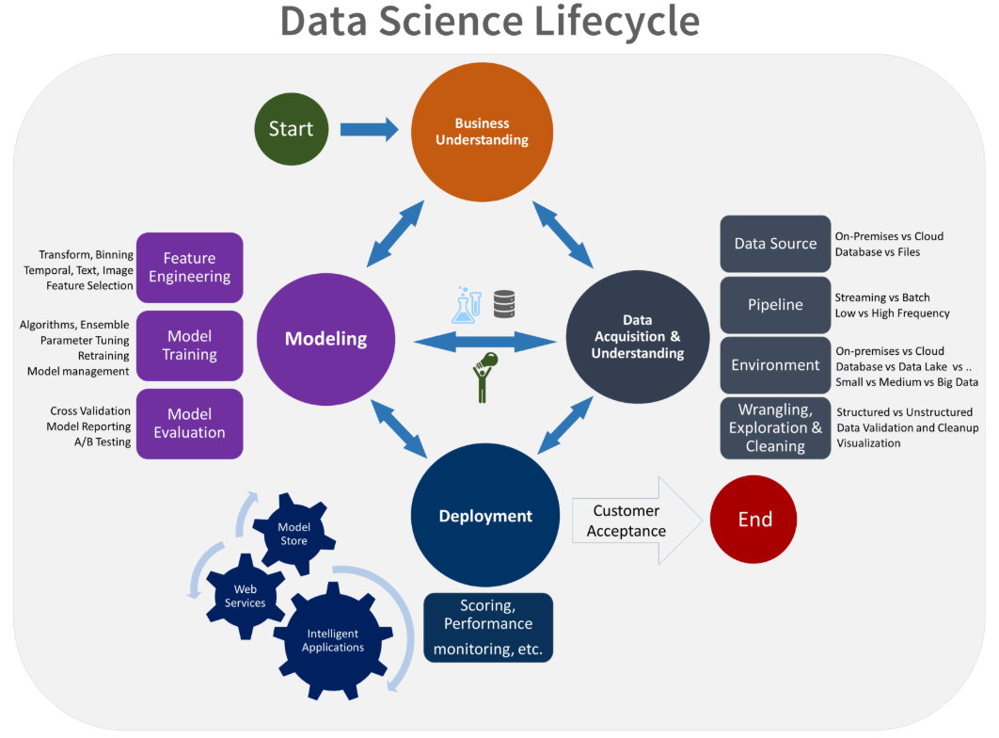
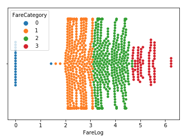
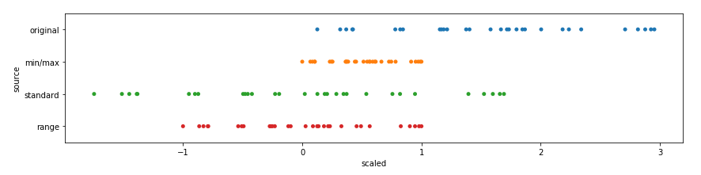

# The Data Science Lifecycle: Data Modelling

TODO What is data modelling? How does it relate to the whole lifecycle?



Table of Content
================================================================================

1. [Data Exploration](#Data-Exploration) (TODO Maybe move to a different file?)
2. [Data Cleaning](#Data-Cleaning)
3. [Feature Creation](#Feature-Creation)
4. [Model Selection](#Model-Selection)

    1. [Regression Models](#Regression-Models)
    2. [Classification Models](#Classification-Models)

5. [Dimensionality Reduction](#Cimensionality-Reduction)

    1. [Feature Selection](#Feature-Selection)
    2. [Feature Extraction](#Feature-Extraction)
    
6. [Model Tuning](#Model-Tuning)
7. [Model Performance Evaluation](#Model-Performance-Evaluation)
8. [Other TODO](#Other-TODO)
9. [Sources](#Sources)


Data Exploration
================================================================================

- Print first rows
    
    ```python
    df.head()
    ```

- Display heatmap of the missing data

    ```python
    _, ax = plt.subplots(figsize=[10,15])
    sns.heatmap(df.isnull(), ax=ax)
    ```

- Display columns which are missing some data

    ```python
    df.columns[df.isnull().any()]
    ```

- Display number of missing entries per feature

    ```python
    df[df.columns[df.isnull().any()].tolist()].isnull().sum()
    ```

    ```python
    df[['Age', 'Cabin', 'Embarked', 'Fare']].isnull().sum()
    ```

    ```python
    df.isnull().sum()
    ```

- Display columns grouped by data type

    ```python
    df.columns.to_series().groupby(df.dtypes).groups
    ```

- Displays number of values

    ```python
    df.groupby(['Age']).size().reset_index(name='Number')
    ```


Data Cleaning
================================================================================

## Remove Noise

- Remove columns

    ```python
    df.drop(columns=['TicketNumber', 'TicketPrefix'], inplace=True)
    ```

- Remove rows with missing data

    ```python
    df = df.dropna()
    ```

## Setting Values

- Setting explicit value

    ```python
    df.loc[df['PassengerId'] == 1044, 'Fare'] = 0
    ```

## Outliers

TODO

## Variable Transformation

- Logarithm

    TODO Why it is being done?
    
    - https://stats.stackexchange.com/questions/18844/when-and-why-should-you-take-the-log-of-a-distribution-of-numbers
    - https://towardsdatascience.com/why-take-the-log-of-a-continuous-target-variable-1ca0069ee935

    ```python
    df['FareLog'] = np.log(df['Fare'] + 1)
    ```

- Square / Cube root

    TODO

- Binning / Discretization

    Grouping number of observations into smaller number of "bins".

    ```python
    df['FareCategory'] = pd.cut(df['FareLog'], bins=4, labels=False)
    ```

    ```python
    sns.swarmplot(x = df['FareLog'], hue=df['FareCategory'],  y=[""]*len(df))
    ```

    

- Dummies, Dummy Variable

    Source: http://www.algosome.com/articles/dummy-variable-trap-regression.html

    While introducing a dummy variable one has to be conscious not fall into the
    Dummy Variable Trap - a scenario in which two or more independent variables 
    are highly correlated (multicollinearity).

    TODO Why is this a problem?

    ```python
    dummies = pd.get_dummies(df[['Sex']], drop_first=True)
    df = pd.concat([df, dummies], axis=1)
    ```

- Factorization

    TODO

- Label Encoding

    Converting strings into numbers

    ```python
    from sklearn.preprocessing import LabelEncoder
    le = LabelEncoder()
    df['AgeClass'] = le.fit_transform(df['AgeClass'])
    ```


Feature Creation
================================================================================

## Indicator Features

## Representation Features

- Domain and Time Extractions TODO

- Numeric to Categorical

    ```python
    df['AgeClass'] = df['Age'].apply(getAgeClass)
    df['AgeClass'] = pd.Categorical(df['AgeClass'], 
                                    categories=[...],
                                    ordered=True)
    ```

    ```python
    df['AgeClass'] = pd.cut(df['Age'], bins=2, labels=['Young', 'Old])
    ```

- Grouping sparse classes TODO

## Interaction Features

- Sum of Features

    ```python
    df['FamilySize'] = df['SibSp'] + df['Parch']
    ```

## Conjuctive Features

## Disjunctive Features

## Programming


Model Selection
================================================================================

> Is there a dependent variable?
>   - **Yes**: Regression or Classification Problem
>   - **No**: Clustering Problem

## Regression Models

- Linear Regression

    http://scikit-learn.org/stable/modules/generated/sklearn.linear_model.LinearRegression.html

    **Pros**: Works on any size of dataset, gives informations about relevance of features 

    **Cons**: The Linear Regression Assumptions

    ```python
    from sklearn.linear_model import LinearRegression

    X_train, X_test, y_train, y_test = train_test_split(X, y)

    est = LinearRegression()
    est.fit(X_train, y_train)
    pred = est.predict(X_test)

    plt.scatter(y_test, pred)
    est.score(X_test, y_test)
    ```

- Polynomial Regression

    http://scikit-learn.org/stable/modules/generated/sklearn.preprocessing.PolynomialFeatures.html

    **Pros**: Works on any size of dataset, works very well on non linear problems

    **Cons**: Need to choose the right polynomial degree for a good bias/variance tradeoff

    ```python
    from sklearn.preprocessing import PolynomialFeatures
    from sklearn.linear_model import LinearRegression

    poly = PolynomialFeatures(2)
    Xpoly = poly.fit_transform(X)
    X_train, X_test, y_train, y_test = train_test_split(Xpoly, y)

    est = LinearRegression()
    est.fit(X_train, y_train)
    pred = est.predict(X_test)

    plt.scatter(y_test, pred)
    est.score(X_test, y_test)
    ```
    
- SVR (Support Vector Regression)

    http://scikit-learn.org/stable/modules/generated/sklearn.svm.SVR.html

    http://scikit-learn.org/stable/modules/generated/sklearn.preprocessing.StandardScaler.html

    **Pros**: Easily adaptable, works very well on non linear problems, not biased by outliers

    **Cons**: Compulsory to apply feature scaling, not well known, more difficult to understand

    **FEATURE SCALING REQUIRED**

    SVR supports multiple kernels: linear, poly, rbf, sigmoid, precomputed.
    The default is rbf. Each of these has different hyperparameters

    TODO What is the use of each kernel?

    ```python
    from sklearn.preprocessing import StandardScaler
    from sklearn.svm import SVR

    scaler = StandardScaler()
    Xscaled = scaler.fit_transform(X)
    X_train, X_test, y_train, y_test = train_test_split(Xscaled, y)

    est = SVR(kernel="rbf")
    est.fit(X_train, y_train)
    pred = est.predict(X_test)

    plt.scatter(y_test, pred)
    est.score(X_test, y_test)
    ```
    
- Decision Tree Regression

    http://scikit-learn.org/stable/modules/generated/sklearn.tree.DecisionTreeRegressor.html

    **Pros**: Interpretability, no need for feature scaling, works on both linear / nonlinear problems

    **Cons**: Poor results on too small datasets, overfitting can easily occur
    
    ```python
    from sklearn.tree import DecisionTreeRegressor

    X_train, X_test, y_train, y_test = train_test_split(X, y)

    est = DecisionTreeRegressor()
    est.fit(X_train, y_train)
    pred = est.predict(X_test)

    plt.scatter(y_test, pred)
    est.score(X_test, y_test)
    ```

- Random Forest Regression

    http://scikit-learn.org/stable/modules/generated/sklearn.ensemble.RandomForestRegressor.html

    **Pros**: Powerful and accurate, good performance on many problems, including non linear

    **Cons**: No interpretability, overfitting can easily occur, need to choose the number of trees

    ```python
    from sklearn.ensemble import RandomForestRegressor

    X_train, X_test, y_train, y_test = train_test_split(X, y)

    est = RandomForestRegressor()
    est.fit(X_train, y_train)
    pred = est.predict(X_test)

    plt.scatter(y_test, pred)
    est.score(X_test, y_test)
    ```

- XGBoost Regressor

    https://xgboost.readthedocs.io/en/latest/python/python_api.html

    **Pros**: TODO

    **Cons**: TODO

    ```python
    
    ```
    

## Classification Models

- Logistic Regression Classification

    http://scikit-learn.org/stable/modules/generated/sklearn.linear_model.LinearRegression.html

    **Pros**: Probabilistic approach, gives informations, about statistical significance of features

    **Cons**: The Logistic Regression Assumptions

    ```python
    from sklearn.linear_model import LinearRegression

    X_train, X_test, y_train, y_test = train_test_split(X, y)

    est = LinearRegression()
    est.fit(X_train, y_train)
    pred = est.predict(X_test)

    plt.scatter(y_test, pred)
    est.score(X_test, y_test)
    ```

- KNN (K Nearest Neighbours) Classification

    http://scikit-learn.org/stable/modules/generated/sklearn.neighbors.KNeighborsClassifier.html

    **Pros**: Simple to understand, fast and efficient

    **Cons**: Need to choose the number of neighbours k

    **FEATURE SCALING REQUIRED**

    ```python
    from sklearn.preprocessing import StandardScaler
    from sklearn.neighbors import KNeighborsClassifier

    scaler = StandardScaler()
    Xscaled = scaler.fit_transform(X)
    X_train, X_test, y_train, y_test = train_test_split(Xscaled, y)

    est = KNeighborsClassifier()
    est.fit(X_train, y_train)
    pred = est.predict(X_test)

    plt.scatter(y_test, pred)
    est.score(X_test, y_test)
    ```

- SVM (Support Vector Machine) Classification

    http://scikit-learn.org/stable/modules/generated/sklearn.svm.SVC.html

    **Pros**: Performant, not biased by outliers, not sensitive to overfitting

    **Cons**: Not appropriate for non linear problems, not the best choice for large number of features

    SVM supports multiple kernels: linear, poly, rbf, sigmoid, precomputed.
    The default is rbf. Each of these has different hyperparameters

    TODO What is the use of each kernel? -> Lectue Kernel SVM ML A-Z

    ```python
    from sklearn.svm import SVC

    X_train, X_test, y_train, y_test = train_test_split(X, y)

    est = SVC(kernel='rbf')
    est.fit(X_train, y_train)
    pred = est.predict(X_test)

    plt.scatter(y_test, pred)
    est.score(X_test, y_test)
    ```

- Kernel SVM Classification

    **Pros**: High performance on nonlinear problems, not biased by outliers, not sensitive to overfitting

    **Cons**: Not the best choice for large number of features, more complex

    TODO What is the use of each kernel? -> Lectue Kernel SVM ML A-Z

- Naive Bayes Classification

    http://scikit-learn.org/stable/modules/generated/sklearn.naive_bayes.GaussianNB.html

    **Pros**: Efficient, not biased by outliers, works on nonlinear problems, probabilistic approach

    **Cons**: Based on the assumption that features have same statistical relevance

    ```python
    from sklearn.naive_bayes import GaussianNB
    
    X_train, X_test, y_train, y_test = train_test_split(X, y)

    est = GaussianNB()
    est.fit(X_train, y_train)
    pred = est.predict(X_test)

    plt.scatter(y_test, pred)
    est.score(X_test, y_test)
    ```

- Decision Tree Classification

    http://scikit-learn.org/stable/modules/generated/sklearn.tree.DecisionTreeRegressor.html

    **Pros**: Interpretability, no need for feature scaling, works on both linear / nonlinear problems

    **Cons**: Poor results on too small datasets, overfitting can easily occur

    ```python
    from sklearn.tree import DecisionTreeRegressor
    
    X_train, X_test, y_train, y_test = train_test_split(X, y)

    est = DecisionTreeRegressor(max_depth=3)
    est.fit(X_train, y_train)
    pred = est.predict(X_test)

    plt.scatter(y_test, pred)
    est.score(X_test, y_test)
    ```

- Random Forest Classification

    http://scikit-learn.org/stable/modules/generated/sklearn.ensemble.RandomForestClassifier.html

    **Pros**: Powerful and accurate, good performance on many problems, including non linear

    **Cons**: No interpretability, overfitting can easily occur, need to choose the number of trees

    ```python
    from sklearn.ensemble import RandomForestClassifier

    X_train, X_test, y_train, y_test = train_test_split(X, y)

    est = RandomForestClassifier()
    est.fit(X_train, y_train)
    pred = est.predict(X_test)

    plt.scatter(y_test, pred)
    est.score(X_test, y_test)
    ```


Dimensionality Reduction
================================================================================

## Feature Selection

### Univariate feature selection

SelectKBest, SelectPercentile

- SelectKBest

    http://scikit-learn.org/stable/modules/generated/sklearn.feature_selection.SelectKBest.html#sklearn.feature_selection.SelectKBest

    **FEATURE SCALING REQUIRED (NEED TO BE >= 0)**

    SelectKBest requires a scoring function to select features. Available are:

    - For regression: f_regression, mutual_info_regression
    - For classification: chi2, f_classif, mutual_info_classif 

    ```python
    from sklearn.feature_selection import SelectKBest
    from sklearn.feature_selection import chi2

    selector = SelectKBest(chi2, k=10)
    X_best = selector.fit_transform(X, y)
    ```

    SelectKBest produces a multidemensional array, it does not contain feature
    labeles. It is possible to retrieve them in following way:

    ```python
    X.columns[selector.get_support(indices=True)].tolist()
    ```

### Recursive feature elimination

TODO

### Meta feature selection

- L1-based

    - For regression: Lasso
    - For classification: LogisticRegression, LinearSVC

    ```python
    from sklearn.feature_selection import SelectFromModel
    from sklearn.svm import LinearSVC
    from sklearn.linear_model import LogisticRegression

    est = LinearSVC(C=0.01, penalty="l1", dual=False).fit(X, y)
    # est = LogisticRegression(C=0.01, penalty="l1", dual=False).fit(X, y)
    selector = SelectFromModel(est, prefit=True)
    X_best = selector.transform(X)

    ```

    ```python
    X.columns[selector.get_support(indices=True)].tolist()
    ```

- TODO: Example of Lasso

- Tree-based

    ```python
    from sklearn.feature_selection import SelectFromModel
    from sklearn.ensemble import ExtraTreesClassifier

    est = ExtraTreesClassifier().fit(X, y)
    selector = SelectFromModel(est, prefit=True)
    X_best = selector.transform(X)
    ```

    ```python
    X.columns[selector.get_support(indices=True)].tolist()
    ```


Feature Extraction
================================================================================

- PCA (Principal Component Analysis)

    Detects the correlation between variables. If there is a strong correlation
    then the dimensionality can be reduced. PCA in an unupervised model, it 
    does not take into account the dependent variable while indentifies independent variables that explain the most the variance of the dataset.

    **FOR LINEAR PROBLEMS**

    **FEATURE SCALING REQUIRED**

    ```python
    from sklearn.decomposition import PCA
    pca = PCA(n_components=None) # n_components=2
    X_train = pca.fit_transform(X_train)
    X_test = pca.transform(X_test)
    explained_variance = pca.explainted_variance_ratio_
    ```

    `n_components=None` will provide a set of ratios for all components
    
    `n_componetns=2` is good for visualisation

- LDA (Linear Discriminant Analysis)

    Looks for independent variables that separate the most the classes if the 
    dependent variable. LDA is a supervised model.

    **FOR LINEAR PROBLEMS**

    **FEATURE SCALING REQUIRED**

    ```python
    from sklearn.discriminant_analysis import LinearDiscriminantAnalysis as LDA
    lda = LDA(n_components=2)
    X_train = lda.fit_transform(X_train, y_train)
    X_test = lda.transform(X_test)
    ```

- Kernel PCA

    **FOR NON-LINEAR PROBLEMS**

    ```python
    from sklearn.decomposition import KernelPCA
    kpca = KernelPCA(n_components=2, kernel='rbf')
    X_train = kpca.fit_transform(X_train)
    X_test = kpca.transform(X_test)
    ```


Model Tuning
================================================================================

## k-Fold Cross Validation

TODO

## Grid Search

TODO


Model Performance Evaluation
================================================================================

TODO

Other TODO
================================================================================

## Imports and default setup

```python
import numpy as np
import pandas as pd
import matplotlib.pyplot as plt
import seaborn as sns

%matplotlib inline
sns.set_style('whitegrid')
```

## Feature Scaling (TODO: move to a better place)



- Min/Max Scaler

    http://scikit-learn.org/stable/modules/generated/sklearn.preprocessing.MinMaxScaler.html

    ```python
    from sklearn.preprocessing import MinMaxScaler

    scaler = MinMaxScaler()
    X_scaled = scaler.fit_transform(X)
    ```

- Standard Scaler

    scikit-learn.org/stable/modules/generated/sklearn.preprocessing.StandardScaler.html

    ```python
    from sklearn.preprocessing import StandardScaler

    scaler = StandardScaler()
    X_scaled = scaler.fit_transform(X)
    ```

- Scaling to specific range

    http://scikit-learn.org/stable/modules/preprocessing.html#scaling-features-to-a-range

    ```python
    import numpy as np
    from sklearn.preprocessing import MinMaxScaler

    scaler = MinMaxScaler(feature_range=[-1,1])
    X_scaled = scaler.fit_transform(X)

    ```

- Converting scaled features into dataframe

    Scalars `fit_transforms` methods return an array, to get dataframe do:

    ```python
    X = pd.DataFrame(scaler.fit_transform(X), columns = X.columns)
    ```

Sources
================================================================================
- https://docs.microsoft.com/en-us/azure/machine-learning/team-data-science-process/overview
- https://towardsdatascience.com/data-preprocessing-for-non-techies-feature-exploration-and-engineering-f1081438a5de
- https://www.class-central.com/report/best-intro-data-science-courses/